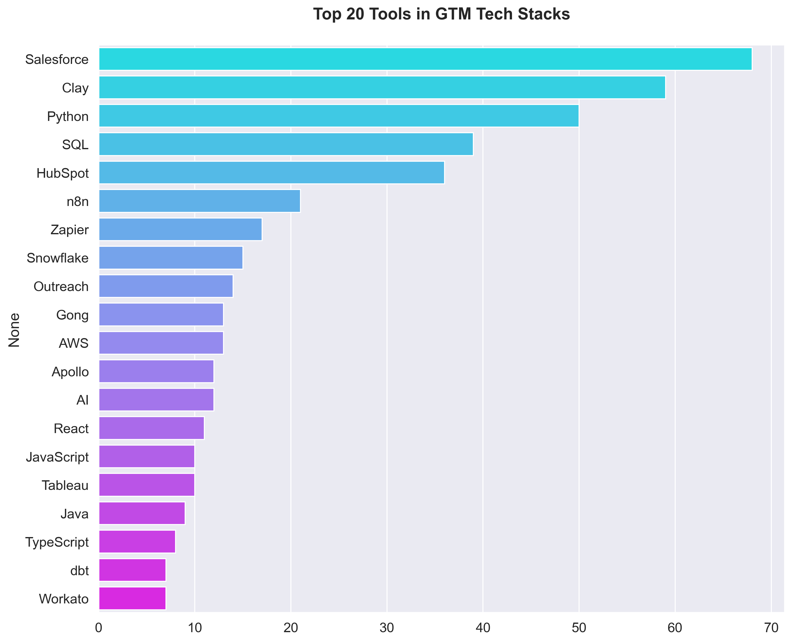
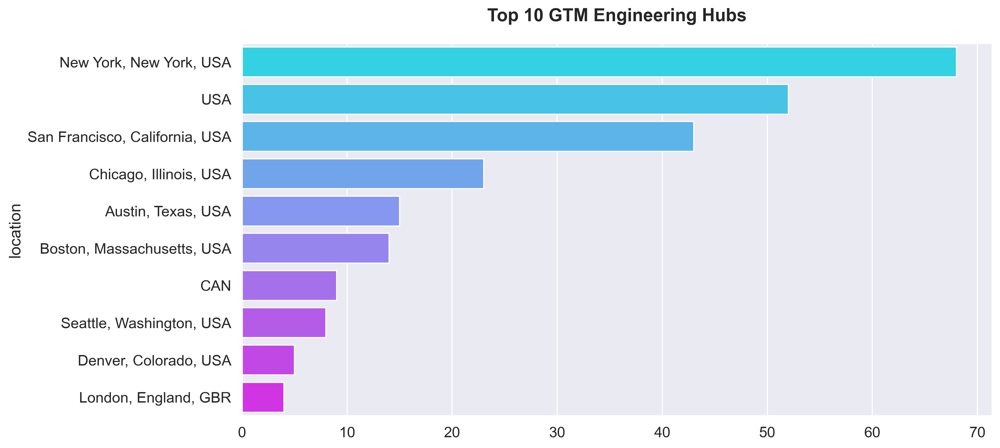
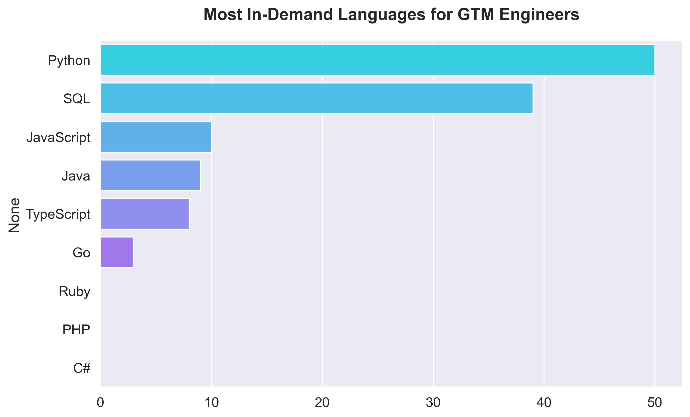

# GTM Engineer Job Market Analysis

**310 high-quality technical GTM positions** · Collected March 2026 · Cities: New York · San Francisco · London · Berlin · Austin TX

Collect and analyze GTM (Go-To-Market) Engineer job descriptions from Builtin.com, structured by city, clean and normalize the data with an LLM extraction step, run a comprehensive Jupyter notebook analysis, and produce GitHub-ready documentation.

Original idea is taken from repository AI Engineering research: https://github.com/alexeygrigorev/ai-engineering-field-guide/tree/main/job-market

## Deployed landing page on Vercel
https://gtm-300-spartans-2026-builtin-jobs.vercel.app/

## Contents

| Path | Description |
|---|---|
| `data_structured/` | Structured YAML files — title, company, tech_stack, compensation |
| `data_raw/` | Raw JSON source from Apify export |
| `analysis.ipynb` | Full analysis notebook with charts & high-density tables |
| `_internal/` | Scraping scripts, structuring scripts, charts, dedup report |

## Stage 1: Data Collection (March 2026)
Successfully collected **829 unique job listings** from Builtin.com across:
- **Regions**: New York, San Francisco, London, Berlin, Austin, and Global Remote.
- **Coverage**: 100% for Title, Company, Location, Description, and URL.
- **Cost**: $0.02 (Apify Free Tier).

## Stage 2: Data Cleaning and Structuring (LLM)
Refined the raw dataset into a structured format focused on Technical Go-To-Market roles.
- **"300 Spartans" Goal**: Achieved **310 leads** identified as "GTM Technical" (37% relevancy rate).
- **Tech Stack Extraction**: Captured modern GTM tools including **Clay**, **n8n**, **Tray.io**, and **Salesforce**.
- **Data Fidelity**: Used JSON as the primary source to preserve 100% text accuracy (solving CSV parsing issues with HTML/newlines).

## Stage 3: Market Insights (March 2026)

Based on the analysis of **310 GTM Technical roles**, here are the key trends in the modern Go-To-Market stack.

### 🛠️ GTM Stack & Tools
The most requested tool is **Salesforce**, but modern "GTM Engineering" tools like **Clay** and **n8n** are showing significant traction. Python and SQL remain the foundational languages for these roles.

| Tool | Frequency | Category |
|---|---|---|
| **Salesforce** | 68 | CRM / System of Record |
| **Clay** | 59 | Data Orchestration / Prospecting |
| **Python** | 50 | Automation / Scripting |
| **SQL** | 39 | Data Analysis |
| **HubSpot** | 36 | CRM / Marketing Automation |
| **n8n** | 21 | Workflow Automation |



### 💰 Compensation Analysis
GTM Engineering is a high-compensation field, with Senior and Staff roles frequently exceeding **$200k USD** base salary. The compensation varies significantly by seniority and region.


### 🌍 Location & Language Trends
The demand for GTM talent is concentrated in major tech hubs, with San Francisco and New York leading. Remote work remains a significant portion of the market.





### 💡 Analysis Highlights
- **GTM Density**: 37.4% of analyzed roles are specifically focused on Technical GTM operations.
- **Modern Orchestration**: Tools like **Clay** are rapidly becoming standard for data-driven outbound operations.
- **Python Dominance**: Python is the clear leader for GTM automation, followed closely by SQL for data analysis.
- **Premium Comp**: High-level individual contributor roles (Staff/Principal) show strong upward salary pressure in Tier-1 hubs.

*Data source: Builtin.com (Scraped March 2026). Analysis based on 310 curated technical roles.*


---

## Technical Details

### Analysis Notebook
For an interactive look at the data, see [analysis.ipynb](analysis.ipynb).

### Prerequisites
Before running the pipeline, you need to set up your API keys...

### 1. Get Your Keys
- **Apify API Token**: Sign up at [Apify](https://apify.com/) and find your token in Settings > Integrations.
- **OpenAI API Key**: Get your key from the [OpenAI Dashboard](https://platform.openai.com/).

### 2. Setup Environment Variables (Windows 11)

To make these keys available to the scripts, follow these steps:

#### Option A: Persistent (via System UI)
1. Press `Win + R`, type `sysdm.cpl`, and press Enter.
2. Go to the **Advanced** tab and click **Environment Variables**.
3. Under **User variables**, click **New**:
   - Variable name: `APIFY_API_TOKEN`
   - Variable value: `your_token_here`
4. Click **New** again:
   - Variable name: `OPENAI_API_KEY`
   - Variable value: `your_key_here`
5. Click OK on all windows and **restart your terminal**.

#### Option B: Temporary (PowerShell)
```powershell
$env:APIFY_API_TOKEN = "your_token_here"
$env:OPENAI_API_KEY = "your_key_here"
```
#### How to check if environment variables are set
```powershell
echo $APIFY_API_TOKEN
echo $OPENAI_API_KEY
```

or in Win 11 CMD:
```cmd
echo %APIFY_API_TOKEN%
echo %OPENAI_API_KEY%
```


### 3. Apify Actors (Automatic Fallback)
The scraping script `_internal/00_run_apify.py` handles actor selection automatically:
- **Primary**: `easyapi/builtin-jobs-scraper` (Optimized, may require subscription)
- **Fallback**: `shahidirfan/builtin-jobs-scraper` (Free-tier friendly)

If the primary actor returns a 403 (Subscription/Proxy error), the script automatically switches to the fallback. Data is normalized across both actors to maintain consistent fields (`title`, `company`, `description`, etc.).

---

*Code and analysis by Antigravity AI, inspired by the AI Engineering Field Guide.*
